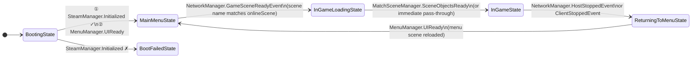
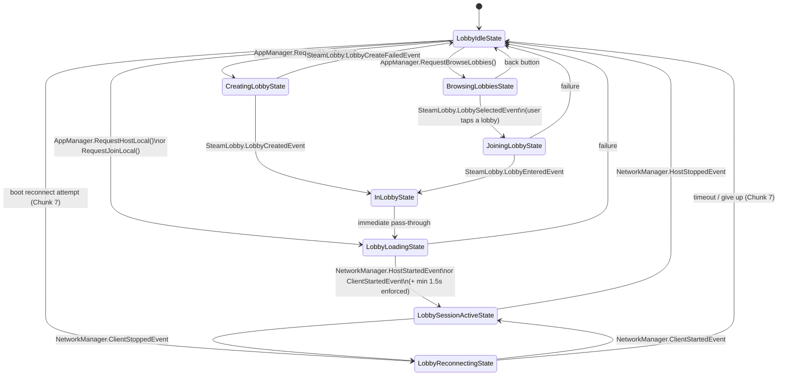
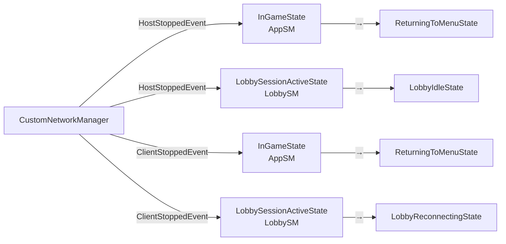
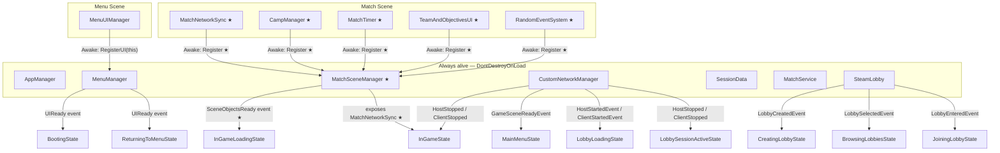

# Island Mayhem — State Machine Flow Reference

> Open with `Ctrl+Shift+V` to render diagrams.
> Reflects current implementation + planned Chunk 6.9 changes (marked ★).

---

## Two Parallel Machines

Both machines start together in `AppManager.Start()` and run for the entire session. They never call each other — they both listen to events fired by injectable managers and react independently.

| Machine | Owns | Concern |
|---|---|---|
| `AppStateMachine` | Scene lifecycle | Which scene is active, is game running |
| `LobbyStateMachine` | Network lifecycle | Steam lobby + Mirror connection |

---

## AppStateMachine



### What each App state does

**`BootingState`**
- Injects: `SessionData`, `MenuManager`
- Checks `SteamManager.Initialized` synchronously on enter
- If Steam OK: loads `SessionData` from PlayerPrefs, then waits for `MenuManager.UIReady` (MenuUIManager must register itself first)
- If Steam not found: immediately → `BootFailedState`

**`MainMenuState`**
- Injects: `MenuManager`, `CustomNetworkManager`
- Calls `menuManager.ShowMainScreen()` on enter
- Listens for `GameSceneReadyEvent` — fires when Mirror finishes loading the online scene on both server and client
- Also checks the current active scene name to confirm it's actually the online scene before transitioning

**`InGameLoadingState` ★ (new in Chunk 6.9)**
- Injects: `MatchSceneManager`, `MatchService`
- Calls `matchSceneManager.SetMatchService(matchService)` so scene-local objects can access it
- If `MatchNetworkSync` is already registered (normal case): transitions immediately
- Otherwise: subscribes to `SceneObjectsReady` and waits (defensive fallback)

**`InGameState`**
- Injects: `AppManager`, `MatchService`, `CustomNetworkManager`, `MatchSceneManager` ★
- Gets `MatchNetworkSync` from `MatchSceneManager` (replaces `FindObjectOfType` ★)
- Assigns `networkManager.matchNetworkSync` directly ★
- Calls `matchNetworkSync.Initialize(matchService)`
- Starts `MatchLifecycleStateMachine`
- Calls `matchSceneManager.Clear()` on exit ★

**`ReturningToMenuState`**
- Injects: `AppManager`, `MenuManager`
- Shows loading screen immediately
- Waits for `MenuManager.UIReady` — fires once `MenuUIManager` has registered itself after the menu scene reloads

---

## LobbyStateMachine



### What each Lobby state does

**`LobbyIdleState`**
- Injects: `CustomNetworkManager`, `SteamLobby`
- On enter: `networkManager.ResetManager()` + `steamLobby.LeaveLobby()`
- Resting state — nothing is happening, user is on main menu
- Transitions out only when `AppManager` calls a Request method (from UI buttons)

**`CreatingLobbyState`**
- Injects: `SteamLobby`
- Subscribes `LobbyCreatedEvent` + `LobbyCreateFailedEvent`, then calls `SteamMatchmaking.CreateLobby()`
- Waits for Steam to confirm lobby creation

**`BrowsingLobbiesState`**
- Injects: `SteamLobby`
- Subscribes `LobbyListReadyEvent` (list populated in UI) + `LobbySelectedEvent` (user picks one)
- Calls `SteamMatchmaking.RequestLobbyList()` with game filter
- `LobbyListReady` doesn't transition — just updates UI. User must select a lobby to advance.
- Stores `SelectedLobbyId` on `LobbyStateMachine` when selection fires

**`JoiningLobbyState`**
- Injects: `SteamLobby`
- Subscribes `LobbyEnteredEvent`, calls `SteamMatchmaking.JoinLobby(selectedId)`

**`InLobbyState`**
- No injections
- Immediately calls `ToNextState()` on enter — it's a semantic marker, not a wait state
- Exists so the graph has a named "lobby joined" node for future expansion

**`LobbyLoadingState`**
- Injects: `CustomNetworkManager`, `MenuManager`, `AppManager`
- Shows loading screen
- If hosting: subscribes `HostStartedEvent`, calls `networkManager.StartHost()`
- If joining: reads host Steam address from lobby data, subscribes `ClientStartedEvent`, calls `networkManager.StartClient()`
- Enforces a minimum 1.5s loading duration so the screen doesn't flash

**`LobbySessionActiveState`**
- Injects: `CustomNetworkManager`
- Pure listener — the session is running, nothing to initiate
- `HostStopped` → host ended normally → back to `LobbyIdle`
- `ClientStopped` → unexpected drop → try `LobbyReconnecting`

**`LobbyReconnectingState`**
- Injects: `SessionData`, `CustomNetworkManager`
- Reconnect logic lives here (full implementation in Chunk 7)
- On enter: calls `StartClient()` with saved host address from `SessionData`
- Waits for `ClientStartedEvent`

---

## The Shared Event Bus — Both Machines Listen

`HostStoppedEvent` and `ClientStoppedEvent` on `CustomNetworkManager` are heard by both machines at the same time. Neither machine knows the other is listening.



---

## DDOL Managers + Scene-Local Registration



---

## Scene Load Timing — Why InGameLoadingState Exists ★

The match scene loads asynchronously. Here is the exact order of events:

```
1. Mirror calls ServerChangeScene / ClientChangeScene
2. Unity loads the match scene
3. All scene objects fire Awake() — in scene order:
       MatchNetworkSync.Awake()  →  MatchSceneManager.RegisterMatchNetworkSync()
       CampManager.Awake()       →  MatchSceneManager.RegisterCampManager()
       MatchTimer.Awake()        →  MatchSceneManager.RegisterMatchTimer()
       TeamAndObjectivesUI.Awake() → MatchSceneManager.RegisterTeamAndObjectivesUI()
4. Mirror calls OnServerSceneChanged / OnClientSceneChanged
       → CustomNetworkManager fires GameSceneReadyEvent
5. MainMenuState hears GameSceneReadyEvent
       → ToNextState() → InGameLoadingState enters
6. InGameLoadingState.OnEnter():
       matchSceneManager.SetMatchService(matchService)   ← scene-locals can now access it
       matchNetworkSync != null? YES (registered in step 3)
       → ToNextState() immediately → InGameState enters
7. InGameState.OnEnter():
       matchNetworkSync = matchSceneManager.MatchNetworkSync   ← guaranteed non-null
       networkManager.matchNetworkSync = matchNetworkSync
       matchNetworkSync.Initialize(matchService)
       MatchLifecycleStateMachine.Start()
```

`InGameLoadingState` is a **synchronisation gate**. It passes through immediately in the normal case (step 6). The `SceneObjectsReady` event subscription is a defensive fallback for any future async-spawned objects.

---

★ = planned change in Chunk 6.9, not yet implemented