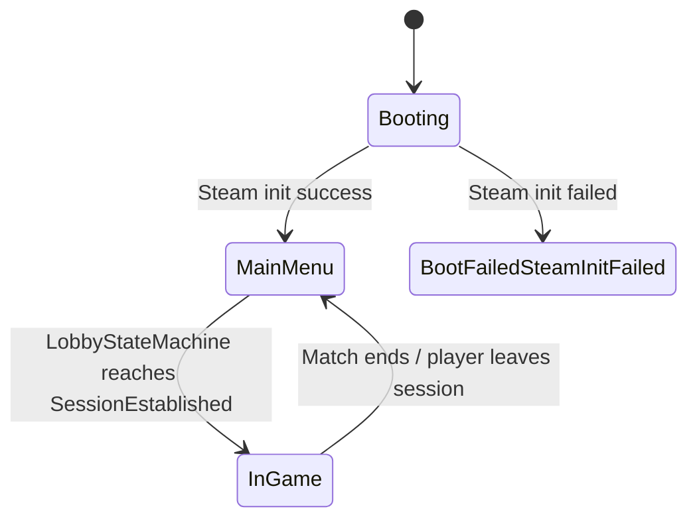
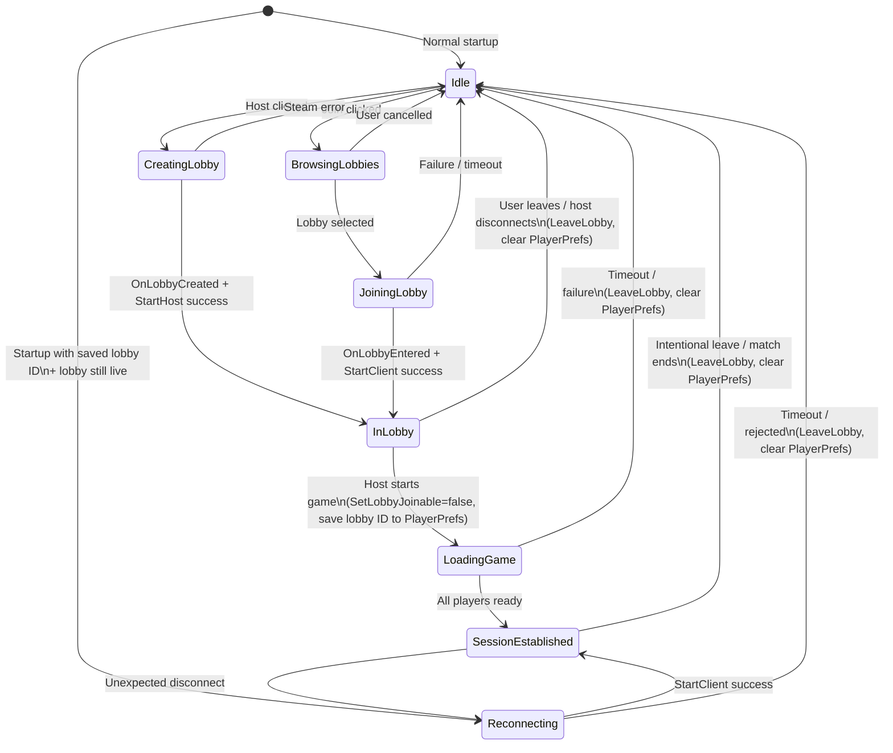
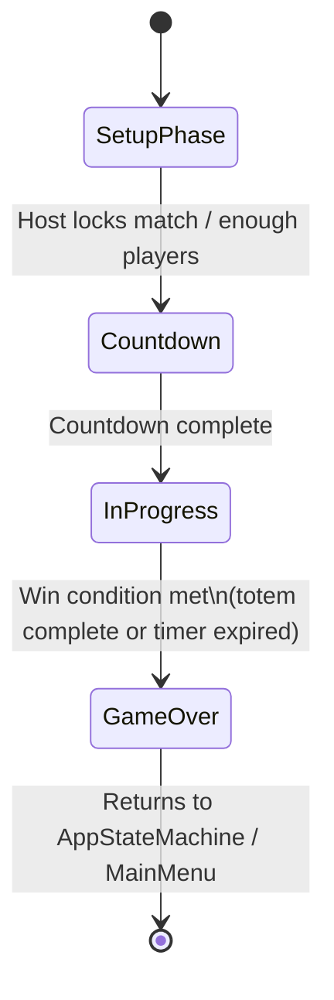
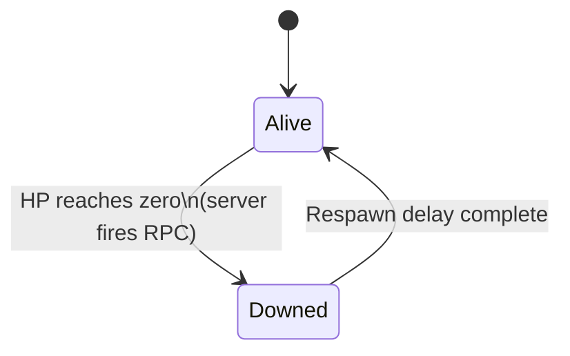

# Island Mayhem — State Machines

## Overview
Three separate state machines, owned by `AppManager`:
- **AppStateMachine** — top level, owns what the app is showing (boot, menu, in-game)
- **LobbyStateMachine** — runs during MainMenu, handles connection/lobby flow
- **MatchStateMachine** — runs during InGame, handles match lifecycle (designed separately)

All three are pure C# classes. `AppManager` is a `DontDestroyOnLoad` MonoBehaviour that holds instances of all three and bridges Unity/Mirror/Steam callbacks into them.

---

## AppStateMachine

### Status
🔄 In design — states and transitions agreed.

### Diagram

### States

| State | Meaning |
|---|---|
| **Booting** | App just launched — running startup checks (Steam init, etc.) |
| **BootFailedSteamInitFailed** | Steam init failed — shows message, dead end state |
| **MainMenu** | Steam ready, player on main menu — LobbyStateMachine active |
| **InGame** | Match running — MatchStateMachine active, menu off |

---

## LobbyStateMachine

### Status
🔄 In design — states, transitions, and architecture agreed. Design decisions (ownership, communication) pending.

### Goal
Replace the implicit, scattered connection state with an explicit state machine that:
- Makes the full lobby/connection flow easy to read and reason about
- Centralizes state transition logic
- Makes it easy to add/modify behavior at any stage (e.g. error handling, loading screens)

### Architecture Decisions

| Decision | Choice | Reason |
|---|---|---|
| Lobby lifecycle | Keep lobby alive during game, set non-joinable on start | Enables reconnect via Steam lobby liveness check — no guesswork |
| LeaveLobby timing | On intentional leave / match ends normally | Not on game start — lobby must persist for reconnect |
| Crash recovery | Save lobby ID to PlayerPrefs on game start | On reboot, check if lobby still live via `GetNumLobbyMembers(lobbyId) > 0` |
| Mid-game disconnect | `StartClient` directly with saved host Steam ID | Player is still a lobby member (lobby non-joinable = no one takes spot) |
| Membership check on reconnect | Not needed | Lobby is non-joinable during game — spot is always held |

### Diagram

### States

| State | Meaning |
|---|---|
| **Idle** | On main menu, nothing connected |
| **CreatingLobby** | Host clicked Host — waiting for `OnLobbyCreated` callback |
| **BrowsingLobbies** | Join clicked — waiting for `OnLobbyMatchList` callback |
| **JoiningLobby** | Lobby selected — waiting for `OnLobbyEntered` + Mirror connect |
| **InLobby** | Everyone seated, waiting for host to start |
| **LoadingGame** | Host started — scene loading, waiting for all clients ready |
| **SessionEstablished** | Connected to a live session — lobby non-joinable, lobby ID saved to PlayerPrefs |
| **Reconnecting** | Unexpected disconnect or reboot with saved lobby ID — attempting `StartClient` with saved host Steam ID |

### Reconnect Flows

**Mid-session disconnect (app still running):**
1. `SessionEstablished` → Mirror detects disconnect → `Reconnecting`
2. `StartClient` with saved host Steam ID (still a lobby member, no lobby interaction needed)
3. Success → `SessionEstablished`. Fail/timeout → `LeaveLobby`, clear PlayerPrefs → `Idle`

**Crash + reboot:**
1. App launches → read lobby ID from PlayerPrefs
2. `GetNumLobbyMembers(lobbyId)` — if > 0, lobby still live → `Reconnecting`
3. `StartClient` with saved host Steam ID
4. Success → `SessionEstablished`. Fail/timeout → clear PlayerPrefs → `Idle`

**Pre-game disconnect (InLobby / LoadingGame):**
- Lobby still joinable → normal rejoin flow (BrowsingLobbies → JoiningLobby)
- No special handling — someone may take the spot and that's fine

### Design Decisions

| Decision | Choice |
|---|---|
| Where does it live? | Pure C# class, owned by `AppManager` |
| Communication in (Mirror/Steam → state machine) | Dedicated service components (`SteamLobbyService`, `MirrorNetworkService`) receive callbacks and call transition methods directly on the state machine |
| Communication out (state machine → world) | C# events — state machine fires `OnStateChanged` and per-transition events. UI panels, services, etc. subscribe directly. Nothing decides anything except the state machine. |
| UI ownership | UI panels are dumb output components — they subscribe to state machine events and show/hide themselves. No UI logic lives outside the state machine. |
| Input components | Dumb — buttons, Steam callbacks, Mirror hooks just report "this happened." Never decide anything. |
| Error handling | Every failing state transitions to a safe state (Idle or one step back) with a reason attached. State machine fires `OnTransitionFailed(fromState, reason)`. UI shows a simple message. No complex recovery logic. |

---

## MatchLifecycleStateMachine

### Status
🔄 In design — states and transitions agreed.

### Notes
- One instance, runs on server and clients
- Server drives transitions via game logic (win condition met, timer expired)
- Clients follow via RPCs — same state machine, driven by RPC inputs
- Replaces the implicit state currently scattered across `MatchManager.Update()`, `TTTMatchManager`, and `SingelTotemMatchManager`
- Win condition (totem objective vs timer) is configurable — state machine doesn't care which, just receives "match over, winner is X"

### Diagram

### States

| State | Meaning |
|---|---|
| **SetupPhase** | Players spawned, can move around, match not started — players can still join/leave |
| **Countdown** | 3, 2, 1 — match locked, about to start |
| **InProgress** | Match running — win conditions being checked on server |
| **GameOver** | Winner determined — showing results before returning to menu |

---

## PlayerStateMachine

### Status
🔄 In design — states and transitions agreed.

### Notes
- One instance per local player, client-side only
- Server never runs this — it fires RPCs that trigger transitions on the client
- Host runs this as a client for their own local player only
- Designed to be easily extended if death/respawn rules change

### Diagram

### States

| State | Meaning |
|---|---|
| **Alive** | Player is active — can move, interact, throw |
| **Downed** | HP hit zero — brief delay, input disabled, waiting to respawn |

---

## Implementation Notes
_To be filled during implementation phase._
